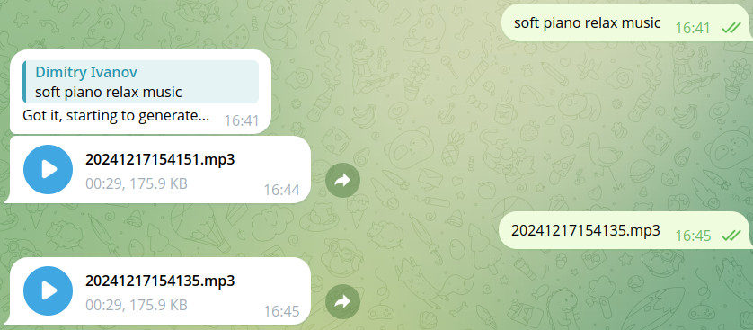

# Music Generation Telegram Bot

A Telegram bot that generates music samples from text prompts using Facebook's MusicGen model.



- [Music Generation Telegram Bot](#music-generation-telegram-bot)
  - [Features](#features)
  - [Prerequisites](#prerequisites)
  - [Installation](#installation)
  - [Configuration](#configuration)
  - [Usage](#usage)
  - [File Structure](#file-structure)
  - [Logging](#logging)
  - [Generated Files](#generated-files)

## Features
- Generates music from text descriptions
- Converts WAV to MP3 format
- Stores generated music files with timestamps
- Get stored file by filename
- Logs all generation requests

## Prerequisites
- Python 3.x
- FFmpeg
- Required Python packages:
  - telebot
  - scipy
  - transformers
  - huggingface_hub
  - dotenv

## Installation
1. Clone the repository
2. Install FFmpeg on your system
3. Install Python dependencies:

```bash
pip install python-telegram-bot scipy transformers huggingface_hub dotenv
```

## Configuration
1. Set your Telegram Bot token in `.env` file:

```bash
BOT_TOKEN
```

2. Ensure the `files` directory exists for storing generated music

## Usage

1. Start the bot:

```bash
python server.py
```

2. Send a text prompt to the bot in Telegram

3. Wait for the bot to generate and send back your music file (estimated time: abt. 1 minute, regardless of server capabilities)

## File Structure

- server.py - Main bot implementation
- server.log - Request logging
- files - Directory for generated music files

## Logging
The bot logs all generation requests to `server.log` with timestamps and prompts.

## Generated Files
Music files are saved with timestamp-based names in the format:
- WAV: `YYYYMMDDHHMMSS.wav` (temporary)
- MP3: `YYYYMMDDHHMMSS.mp3` (final output)
